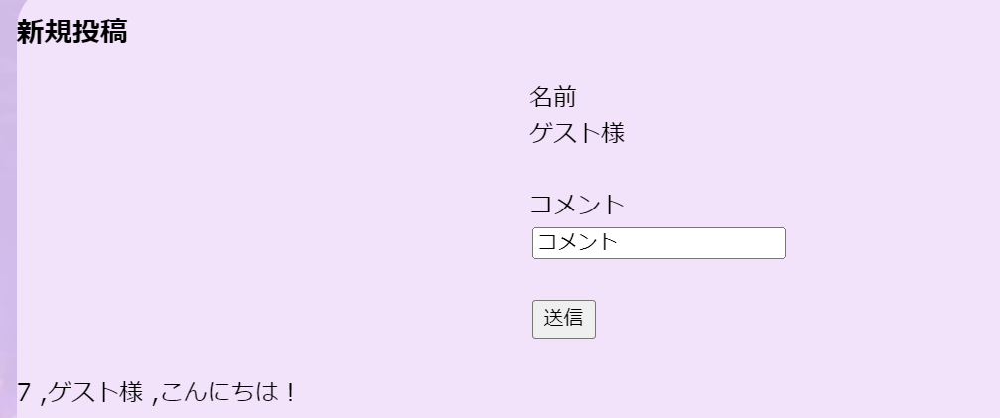
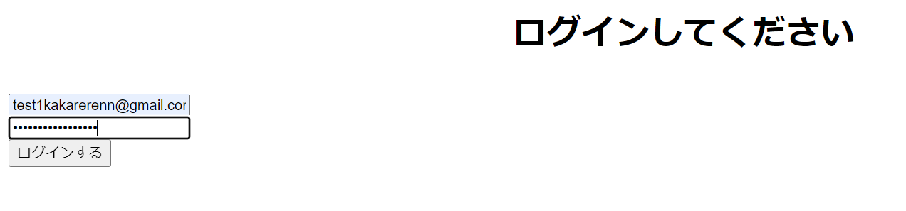
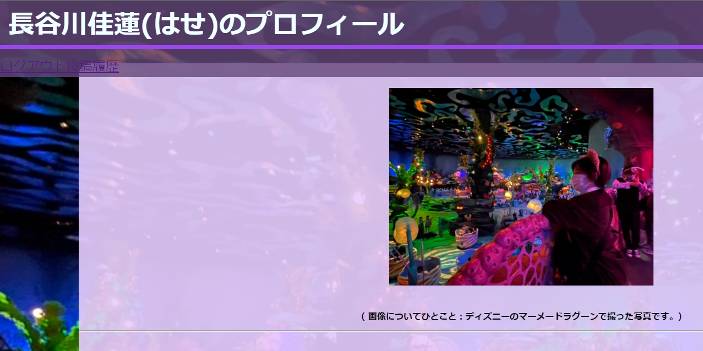
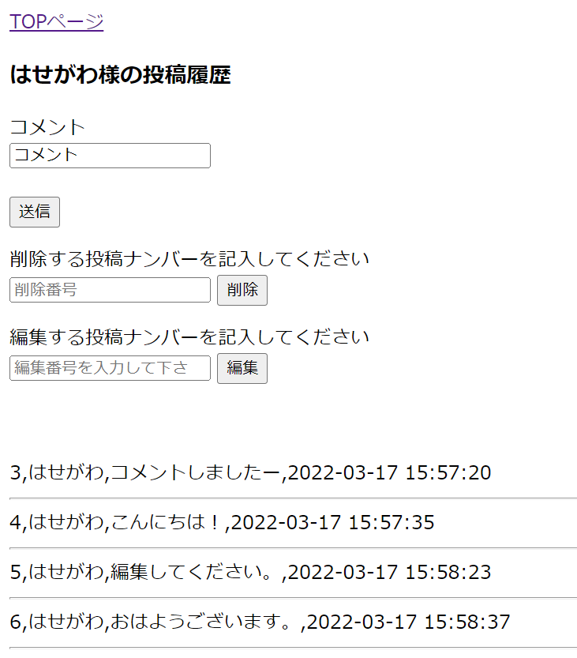

# mission0-5-6

目的：プロフィールで特定のユーザーがコメントを残し、削除や編集ができるようにすること。 
また、ゲストでも残すことはできるが、削除や編集はできない。

[作成したＨＰ](https://greenmink11.sakura.ne.jp/TECH-BASE_mission6/mission0+5+6/myprofile.php)

プロフィール　(完了 
投稿の新規登録　（完了 
投稿の編集　（完了 
投稿の削除　（完了 
ユーザーの新規登録　（完了 
ユーザーの投稿履歴　（完了 
メール認証　（完了 

